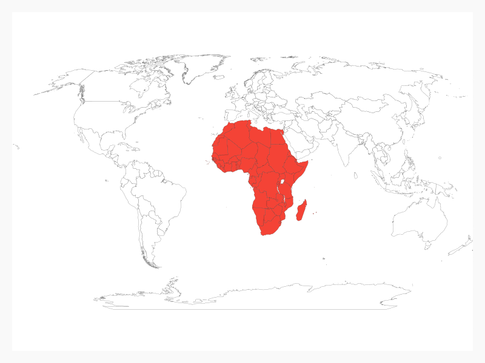
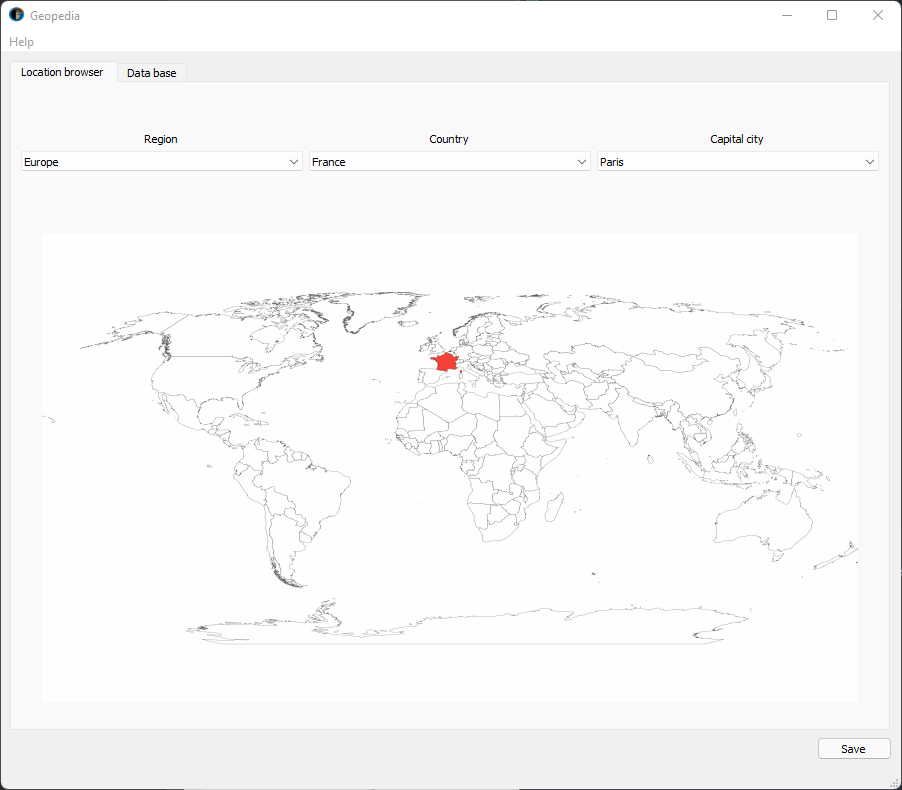
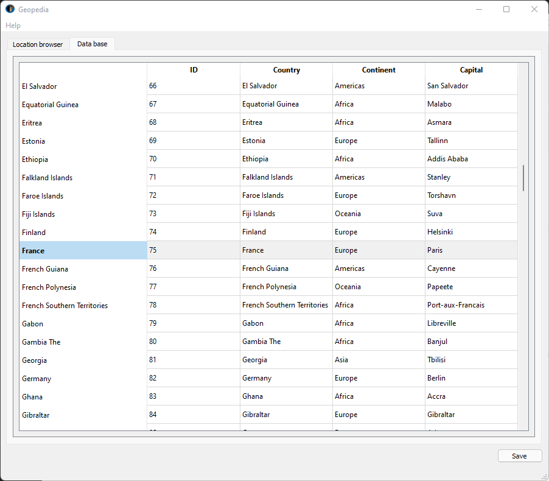

# Geopedia (Regions, Countries, Capital cities)
Is Egypt in Asia ? What is Ouagadougou the capital city of ? How many continent there is on Earth ?

Geopedia is the solution for the ones that need to answer those types of questions.

## How to use Geopedia ?
### Location browser

#### Region
Select a region (continent) among these :

- Africa
- Americas
- Asia
- Europe
- Oceania
- Antarctica

The map reloads and highlight all countries part the selected region.

#### Country
Select a country among 250 countries / states and territories available !

The map reloads and highlight the selected country.

#### Capital city
If you ever wanted to know the name of each country's capitals !

### Data Base 
Second tab shows our data base used for this application. Currently, we are using a json file from dr5hn
countries-states-cities-database repository on GitHub(Thank you!).

### Save button 
Save your map with the "Save" button. Geopedia currently support only PNG images.

## Credits 
This application is built with Python programming language and QtDesigner software.

Dependencies are :

- PyQt5
- pygal
- CairoSVG